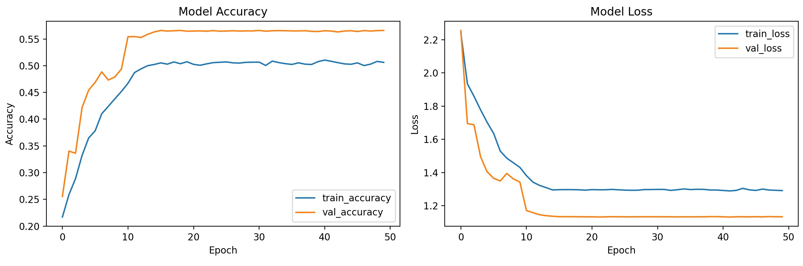
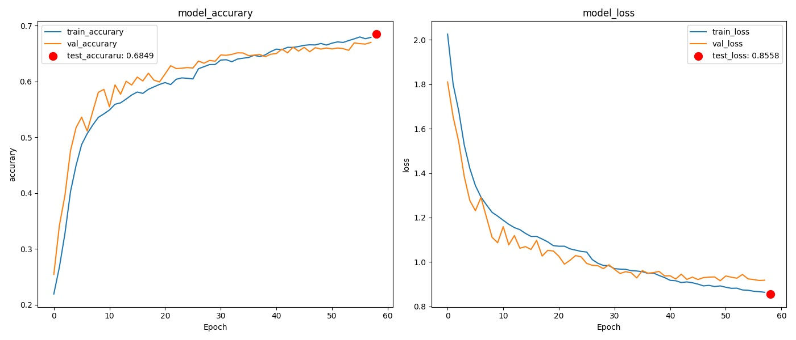

STEP1：  
1.使用了验证集（不再是训练集中取10%）  
2.进行了数据增强，识别放缩，旋转的人脸  
datagen = ImageDataGenerator(
    rotation_range=30,        # 旋转±30度
    width_shift_range=0.2,    # 水平平移
    height_shift_range=0.2,   # 垂直平移
    shear_range=0.2,          # 剪切变换（模拟歪头）
    zoom_range=0.2,           # 随机缩放
    horizontal_flip=True,     # 水平翻转
    fill_mode='nearest'
)  
3.增加CNN架构的滤波器（翻倍），增强特征提取能力和模型容量
  
学习效果：  
训练准确率: 从20%上升到55%  
验证准确率: 从20%上升到50%  
最终准确率: 训练集55%，验证集50%  
非常糟糕，基本没学会，欠拟合  

STEP2:
1.增加注意力机制：不同情绪需要关注不同的面部区域，增加不同的权重    
2.动态学习率：前期学习率较大，快速离开随机区域，中期学习率中等，以防错过最优解，后期较小，精细调整避免震荡 
  
学习效果：验证准确率下降，过拟合更加严重，总体准确率没有提高  
原因分析：1.在三个卷积块都添加了注意力机制，注意力机制过于复杂，小数据集上容易过拟合    
def channel_attention_module(input_tensor, reduction_ratio=16):
#通过全局平均池化获取通道重要性，使用全连接层学习通道权重
    # 获取输入张量的通道数
    channels = input_tensor.shape[-1]
    # 全局平均池化：将每个通道的空间信息压缩为一个值 (batch_size, channels)
    gap = GlobalAveragePooling2D()(input_tensor)
    # 重塑形状，与原式特征图形状匹配，以便后续全连接层处理 (batch_size, 1, 1, channels)
    gap_reshaped = Reshape((1, 1, channels))(gap)
    # 第一个全连接层：降低维度，减少参数数量，提取关键特征
    fc1 = Dense(channels // reduction_ratio, activation='relu')(gap_reshaped)
    # 第二个全连接层：恢复原始通道数，获得每个通道的重要性分数
    fc2 = Dense(channels, activation='sigmoid')(fc1)
    # 将学习到的通道权重与原始输入相乘，实现特征重标定
    return Multiply()([input_tensor, fc2])  
#使用函数式API构建模型，以便添加注意力机制，顺序模型无法支持这样的机制
input_tensor = tf.keras.Input(shape=(IMAGE_WIDTH, IMAGE_HEIGHT, 1))
#第一卷积块
x=Conv2D(64, (3, 3), activation='relu', padding='same')(input_tensor)
x=BatchNormalization()(x)#批归一化
x = channel_attention_module(x)  # 添加通道注意力机制
x=MaxPooling2D((2, 2))(x)#最大池化：保留最显著的特征，对特征位置变化不敏感，大幅减少参数和计算量
x=Dropout(0.25)(x)#随机丢弃神经元，迫使每个神经元都要有用，防止过于依赖某一特征
#第二卷积块
x=Conv2D(128, (3, 3), activation='relu', padding='same')(x)#卷积核数量从32增加到64，学习更复杂的特征
x=BatchNormalization()(x)
x = channel_attention_module(x)
x=MaxPooling2D((2, 2))(x)
x=Dropout(0.25)(x)
#第三卷积块
x=Conv2D(256, (3, 3), activation='relu', padding='same')(x)#卷积核数量增加到128，学习高级特征
x=BatchNormalization()(x)
x = channel_attention_module(x)
x=MaxPooling2D((2, 2))(x)
x=Dropout(0.25)(x)
#分类头
x=Flatten()(x)#展平层：空间特征转化为特征向量
x=Dense(1024, activation='relu')(x)#全链接层
x=BatchNormalization()(x)
x=Dropout(0.5)(x)
output_tensor = Dense(NUM_CLASSES, activation='softmax')(x)#输出层
#创建模型
model = Model(inputs=input_tensor, outputs=output_tensor)  
2.1024个神经元的全连接层参数过多，对于7分类任务严重过参数化，容易记住训练数据而不是学习泛化特点  
3.学习策略不是根据模型的实际情况做动态调整，不够激进  
def lr_scheduler(epoch, lr):
    if epoch < 10:
        return lr  # 前10轮保持初始学习率
    elif epoch < 30:
        return lr * 0.5  # 10-30轮学习率减半
    else:
        return lr * 0.1  # 30轮后学习率降至0.1倍  
4.缺少早停机制，没有保存最佳模型  

STEP3:
1.利用残差网络优化原来的简单CNN模型，提高模型对于精细特征提取能力；
2.增加了学习率调整，前期速率较大，后期逐步减小便于精细优化；
3.增加了早停机制，更加有效地防止过拟合现象；
4.增加测试集作为最终测试，便于更直接反应结果；
5.在数据增强部分增加光线变化，有利于弥补FER2013数据集光线条件较少对真实生活模拟度较低的情况。
学习效果如下图：
  
总结：
准确率相对提升（FER2013的人类识别准确率在65%-72%之间）。
后续优化想法：1.增加注意力机制2.针对FER2013的特点对厌恶等情绪进行权重调整3.用FER+作为升级版数据集  

STEP4:
1.引入CBAM注意力机制：  
def cbam_block(input_tensor, reduction_ratio=16):
    """
    CBAM注意力机制：输入特征图 → 通道注意力 → 空间注意力 → 增强后的特征图
    通道注意力：决定"关注哪些特征"：为64个通道生成权重
    空间注意力：决定"关注哪个位置"： 为48×48个位置生成权重
    """
    def channel_attention(input_tensor, reduction_ratio=reduction_ratio):
        # 获取通道数
        channels = input_tensor.shape[-1]
        avg_pool = GlobalAveragePooling2D()(input_tensor)#平均池化：保留整体趋势
        max_pool = GlobalMaxPooling2D()(input_tensor)#最大池化：保留最显著特征
        # 共享的多层感知机
        # 平均池化分支
        avg_out = Dense(channels // reduction_ratio, activation='relu')(avg_pool)#缩减通道数的全连接层，提取重要信息
        avg_out = Dense(channels, activation='sigmoid')(avg_out)#恢复通道数的全连接层
        # 最大池化分支
        max_out = Dense(channels // reduction_ratio, activation='relu')(max_pool)
        max_out = Dense(channels, activation='sigmoid')(max_out)
        # 合并两个分支
        cbam_feature = Add()([avg_out, max_out])
        cbam_feature = Activation('sigmoid')(cbam_feature)#得到每个通道的权重
        # 重塑为 [batch_size, 1, 1, channels]
        cbam_feature = Reshape((1, 1, channels))(cbam_feature)
        # 应用注意力权重
        return Multiply()([input_tensor, cbam_feature])
    def spatial_attention(input_tensor):
        # 使用Lambda层进行通道维度的池化
        avg_pool = Lambda(lambda x: K.mean(x, axis=3, keepdims=True))(input_tensor)
        max_pool = Lambda(lambda x: K.max(x, axis=3, keepdims=True))(input_tensor)
        # 拼接平均池化和最大池化结果
        concat = Concatenate(axis=3)([avg_pool, max_pool])
        # 使用卷积层生成空间注意力图
        conv = Conv2D(
            filters=1,
            kernel_size=(7, 7),
            padding='same',
            activation='sigmoid'
        )(concat)
        # 应用空间注意力权重
        return Multiply()([input_tensor, conv])
    # 依次应用两个注意力
    x = channel_attention(input_tensor)
    x = spatial_attention(x)
    return x  
学习效果：没有提高，反而使准确律降低了一个百分点  
原因分析：1.数据库不够庞大，学到了噪声而非模式  
2.引入额外非线性，训练曲线震荡，收敛更慢，最终性能可能更差
